## 🔄 現在の開発中プロジェクト
<!-- PROJECTS:START -->
### 🔄 Currently Building
- **[kskmasa](https://github.com/kskmasa/kskmasa)** — No description  
  Python • ⭐ 0 • updated 6m ago
- **[UseGithubHowTo](https://github.com/kskmasa/UseGithubHowTo)** — No description  
  - • ⭐ 0 • updated 1d ago
<!-- PROJECTS:END -->

## 🏃 最近の活動
<!-- ACTIVITY:START -->
### 🏃 Recent Activity
- ⏺️ pushed **2** commit(s) to [kskmasa](https://github.com/kskmasa/kskmasa)  6h ago
- ⏺️ pushed **6** commit(s) to [kskmasa](https://github.com/kskmasa/kskmasa)  1d ago
- ⏺️ pushed **1** commit(s) to [UseGithubHowTo](https://github.com/kskmasa/UseGithubHowTo)  1d ago
<!-- ACTIVITY:END -->

## 🕓 今月のアクティビティ
<!-- MONTHLY_GRAPH:START -->
### 🕓 This Month

<!-- MONTHLY_GRAPH:END -->
