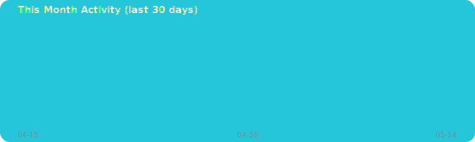

<!-- =========================================================
GitHub Profile README — Modern / Minimal / Animated
TODO:
  1) kskmasa を自分のIDに置換
  2) 各SNSリンクを差し替え
  3) assets/monthly_activity.svg はワークフローが自動生成
========================================================= -->

# 👋 Hi, I'm Tanakaaa
*Designing systems that make life simpler and smarter.*

✨ Full-stack Engineer / Product Designer  
💡 AI Automation・Productivity Apps・Creative Tools

  
  

---

### 🧠 Tech Stack

> “Design isn’t what it looks like — it’s how it works.”

---

## 🔄 現在の開発中プロジェクト
<!-- PROJECTS:START -->
### 🔄 Currently Building
- **[kskmasa](https://github.com/kskmasa/kskmasa)** — No description  
  Python • ⭐ 0 • updated 23h ago
- **[advent-5x5-hands-on-template](https://github.com/kskmasa/advent-5x5-hands-on-template)** — 5日×5テーマのハンズオンAdventテンプレート  
  Python • ⭐ 0 • updated 184d ago
- **[UseGithubHowTo](https://github.com/kskmasa/UseGithubHowTo)** — No description  
  - • ⭐ 0 • updated 191d ago
<!-- PROJECTS:END -->

---

## 🏃 最近の活動
<!-- ACTIVITY:START -->
_No recent public activity_
<!-- ACTIVITY:END -->

---

## 🕓 今月のアクティビティ
<!-- MONTHLY_GRAPH:START -->
### 🕓 This Month

<!-- MONTHLY_GRAPH:END -->

---

### 🌐 Connect

  

